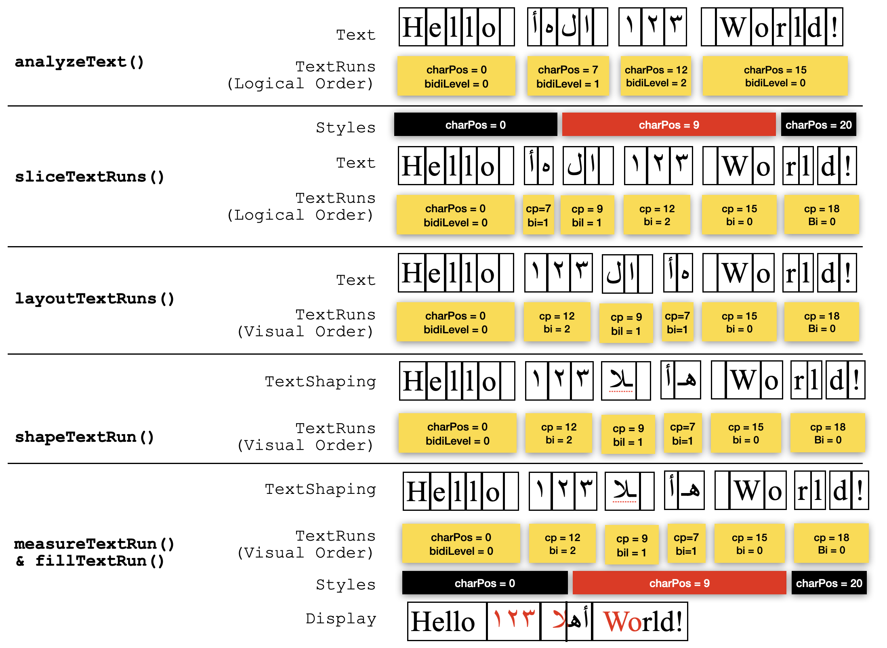

# Canvas Text Shaping

The text support in HTML canvas is very limited. Because 2D canvas is used nowadays to support complex text scenarios such as word processor, the need for complex text support became evident. 

## API purpose

Extend the capabilities of `CanvasRenderingContext2D` to support text shaping and layout. This would additionally enable precise caret positioning, hit testing and text selection rectangles calculations.

## Summary of the Google proposal

Google has presented this [proposal](https://github.com/fserb/canvas2D/blob/master/spec/enhanced-textmetrics.md). Their proposal addresses a single problem: calculating the [grapheme cluster boundaries](https://www.unicode.org/reports/tr29/#Grapheme_Cluster_Boundaries). The cluster boundaries will be respected in displaying,  hit-testing, caret positioning and selection rectangles calculations. This allows drawing clusters in isolation.

The TextMetrics is extended in this proposal to allow calculating the text clusters. A clusters holds but does not expose: its text and its font. This how their APIs can be used to draw text cluster by cluster.

```
let tm = ctx.measureText(text);
let clusters = tm.getTextClusters();

for(let cluster of clusters)
    ctx.fillTextCluster(cluster, 0, 0);
```

## Problems with the Google proposal 

This proposal addresses a single problem and does not state how it can be extended in the future. So this proposal:

1. Is not extensible. It does everything in one step which is `getTextClusters()`. It does not allow the client to intervene to achieve custom display for example.
2. Does not support processing rich text where multiple fonts/colors are applied to a line of text.
3. Extends `TextMetrics` and makes it own the text and the shaping info of the measured text. Currently `TextMetrics` just returns the geometry of the measured text.
4. Is not efficient when displaying text with the same font/color cluster by cluster

## WebKit proposal

This proposal presents different levels of text shaping. It allows the client to alter the output of a function before sending it to another function. This makes the interface simple and extensible. It addresses most of the text shaping functionalities. Most of these functionalities are straightforward to implement. A few of them need the system frameworks to be implemented.

## IDL changes

The IDL changes below can be grouped into four categories:

1. Shaping APIs
2. TextRun Drawing APIs
3. TextRun Geometry APIs
4. Text Geometry APIs

```
dictionary TextScript {
    unsigned short bidiLevel;
};

dictionary TextRun {
    unsigned long start;
    DOMString text;
    TextScript script;
};

dictionary TextShaping {
    sequence<unsigned long> glyphs;
    sequence<unsigned long> charToGlyph;
};

dictionary TextCluster {
    TextRun run;
    TextShaping shaping;
};

interface mixin CanvasText {
    // ... extended from current CanvasText.

    // Text shaping
    sequence<TextRun> analyzeText(DOMString text);
    sequence<TextRun> sliceTextRuns(sequence<TextRun> runs, sequence<unsigned long> ranges);
    sequence<unsigned long> layoutTextRuns(sequence<TextRun> runs);
    TextShaping shapeTextRun(TextRun run);
    sequence<TextCluster> textRunClusters(TextRun run);

    // TextRun drawing
    undefined fillTextRun(TextRun run, TextShaping shaping, double x, double y);
    undefined strokeTextRun(TextRun run, TextShaping shaping, double x, double y);

    // TextRun geometry
    TextMetrics measureTextRun(TextRun run, TextShaping shaping);
    unsigned long textRunXToCharPos(TextRun run, TextShaping shaping, double x);
    double textRunCharPosToX(TextRun run, TextShaping shaping, unsigned long charPos);
    sequence<DOMRectReadOnly> textRunSelectionRect(TextRun run, TextShaping shaping, unsigned long start, unsigned long end);

    // Text extensions
    unsigned long textXToCharPos(DOMString text, double x);
    double textCharPosToX(DOMString text, unsigned long charPos);
    sequence<DOMRectReadOnly> textSelectionRects(DOMString text, unsigned long start, unsigned long end);
};
```

## Definitions

**TextRun**: It is a sequence of characters that have the same script and direction. Note all the neutrals should be included with any `TextRun`. For example a line of Latin text will be represented by one `TextRun`.

**VisualOrder:** It is the result of function `layoutTextRuns()` . The array `logicalToVisual` maps from a logical index to the visual index of the `TextRun`. For example this text: **Hello أهلا ١٢٣ World!** will have these four `TextRuns` **:**
**Hello**
**أهلا**
**١٢٣**
**World!**
 **** `logicalToVisual` will have these indices `[ 0, 2, 1, 3]` because the numbers `TextRun` appears second in the display even it comes third in `TextRuns`

**glyphs:** These are code points in the font. The same character can be displayed by different glyphs. This depends on the which characters are before and after this character.

**charToGlyph**: This is a mapping from characters indices to a sequence of glyph indices which have to be displayed atomically. For example suppose a `TextRun` has 5 characters and its `TextShaping` has 8 glyphs, if the array charToGlyph has these values `[ 0, 0, 4, 7, 7 ]` this will mean the following:

* Characters: 0, 1 map to Glyphs: 0, 1, 2, 3
* Characters: 2 maps to Glyphs: 4, 5. 6
* Character 3, 4 map to Glyph 7

Notice: 

* The length of **charToGlyph** is equal to the length of the text. 
* **charToGlyph** maps each character index to the index of the first glyph in the cluster. 
* If more than one character participate in the same cluster, **charToGlyph** will give the same index for all of them. 
* The length of the cluster is difference between the index of the first glyph in this cluster and the the index of the first glyph in the next cluster.

## TextRuns layout

**This polyfill shows how  `layoutTextRuns()` API can be implemented.  The algorithm is simple and it mainly depends on the `bidiLevels` of the `TextRuns` which are calculated by `analyzeText()`.**

```
CanvasText.prototype.layoutTextRuns = function(runs)
{
    // Create an array where index v holds the logical index l = v.
    const logicalToVisual = Array.from({ length: run.length }, (_, index) => index);

    // Find levels range
    const levels = runs.map(run => run.script.bidiLevel);
    const maxLevel = Math.max(...levels);
    const minLevel = Math.min(...levels);
    const minEmbeddingLevel = Math.max(minLevel, 1);

    const reverse = function(array, start, end) {
        for (--end; start < end; ++start, --end)
            [array[start], array[end]] = [array[end], array[start]];
    };

    // Loop level from maxLevel down to the lowest embedding level
    for (let level = maxLevel; level >= minEmbeddingLevel; --level) {
        // Scan the levels array for contiguous runs where the 
        // character's embedding level is >= level
        let i = Infinity;
        for (let j = 0; j < runs.length; ++j) {
            if (levels[j] >= level)
                i = Math.min(i, j);
            else if (i < j) {
                // Reverse the contiguous range in the visual mapping
                reverse(logicalToVisual, i, j);
                i = Infinity;
            }
        }
        reverse(logicalToVisual, i, runs.length);
    }

    return logicalToVisual;
}
```

## Drawing text

**This polyfill shows how the existing `fillText()` API can be implemented using the proposed shaping APIs.** 

Loop through all the `TextRuns` in their visual order. Get the shaping of each `TextRun` . Display and measure the `TextRun` . Advance the x-position by the width of the `TextRun` .

```
CanvasText.prototype.fillText = function(text, x, y)
{
    const runs = this.analyzeText(text);
    const logicalToVisual = this.layoutTextRuns(runs);

    for (let i = 0; i < runs.length; ++i) {
        const visualIndex = logicalToVisual[i];
        const run = runs[visualIndex];

        const shaping = this.shapeTextRun(run);
        const metrics = this.measureTextRun(run, shaping);

        this.fillTextRun(run, shaping, x, y);
        x += width;
    }
}
```

This diagram below shows how the text **Hello أهلا ١٢٣ World!** is processed to be displayed:

## Hit-testing

**This polyfill shows how  t`extXToCharPos()` API can be implemented using the proposed shaping APIs.** 

Loop through all the runs in their visual order. If a `TextRun` contains the x-position call `textRunXToCharPos()` given this `TextRun` and the relative x-position. Return the retuned `charPos` .

```
CanvasText.prototype.textXToCharPos = function(text, x)
{
    const runs = this.analyzeText(text);
    const logicalToVisual = this.layoutTextRuns(runs);

    for (let i = 0; i < runs.length; ++i) {
        const visualIndex = logicalToVisual[i];
        const run = runs[visualIndex];

        const shaping = this.shapeText(run);
        const metrics = this.measureTextRun(run.script, shaping);

        if (x < metrics.width)
            return this.textRunXToCharPos(run, shaping, x);
        x -= metrics.width;
    }

    return text.length;
}
```

## Getting the caret position

**This polyfill shows how  `textCharPosToX()` API can be implemented using the proposed shaping APIs.** 

Loop through all the `TextRuns` in their visual order. If a `TextRun` contains the `charPos` , get the x-position of `charPos` within this `TextRun`. Return the x-position relative to the beginning of the text.

```
CanvasText.prototype.textCharPosToX = function(text, charPos)
{
    const runs = this.analyzeText(text);
    const logicalToVisual = this.layoutTextRuns(runs);
    let x = 0;

    for (let i = 0; i < runs.length; ++i) {
        const visualIndex = logicalToVisual[i];
        const run = runs[visualIndex];

        const shaping = this.shapeTextRun(run);
        const metrics = this.measureTextRun(run, shaping);

        if (charPos >= start && charPos < end)
            return x + this.textRunCharPosToX(run, shaping, charPos);
        x += metrics.width;
    }

    return x;
}
```

## Getting the selection rects

**This polyfill shows how  `textSelectionRects()` API can be implemented using the proposed shaping APIs.** 

Loop through all the `TextRuns` in their visual order. If a `TextRun` interests with the selection range, get the rectangle of this intersection. Try to combine the new rectangle with the last calculated rectangle if they are adjacent horizontally. Otherwise append a new rectangle.

```
CanvasText.prototype.textSelectionRects = function(text, start, end)
{
    const runs = this.analyzeText(text);
    const logicalToVisual = this.layoutTextRuns(runs);
    const rects = [];

    for (let i = 0; i < runs.length; ++i) {
        const visualIndex = logicalToVisual[i];
        const run = runs[visualIndex];

        // Intersect [start, end] with TextRun range
        const startRange = Math.max(run.start, start);
        const endRange = Math.min(run.start + run.text.length, end);
        if (startRange >= endRange)
            continue;

        const shaping = this.shapeText(run);
        const rect = this.textRunSelectionRect(run, shaping, startRange, endRange);

        // Try to combine the new rect with the last rect.
        // Otherwise add a new rect.
        if (rects.length && rects[rects.length - 1].right == rect.left)
            rects[rects.length - 1].right = rect.right;
        else
            rects[rects.length] = DOMRect.fromRect(rect);
    }

    return rects;
}
```

## Getting the TextClusters of TextRun

**This polyfill shows how  `textRunClusters()` API can be implemented using the proposed shaping APIs.** 

Loop through the characters of the `TextRun` and create a `TextCluster` for each grapheme cluster using `TextShaping.charToGlyph` . 

```
CanvasText.prototype.textRunClusters = function(run)
{
    const shaping = this.shapeTextRun(run);
    const clsuters = [];
    let textStart = 0;

    for (let j = 0; j < run.text.length; ++j) {
        // All the characters of a cluster has to map to the same first glyph index.
        if (j < t.length - 1 && shaping.charToGlyph[j] == shaping.charToGlyph[j + 1])
            continue;

        // Calculate the start and the end of the cluster from shaping.charToGlyph.
        const glyphStart = shaping.charToGlyph[j];
        const glyphEnd = (j == run.text.length - 1) ? shaping.glyphs.length : shaping.charToGlyph[j + 1];

        // Create a TextRun for this cluster
        TextRun clusterRun = { 
            textStart,
            run.text.slice(textStart, j - textStart + 1),
            run.script
        };

        // Create a TextShaping for this cluster
        TextShaping clusterShaping = {
            shaping.glyphs.slice(glyphStart, glyphEnd),
            Array(clusterRun.text.length).fill(0)
        };

        clsuters[clusters.length] = { clusterRun, clusterShaping };
    }

    return clusters;
}
```

## Drawing colored clusters

**This example shows how the Goole examples in their [proposal](https://github.com/fserb/canvas2D/blob/master/spec/enhanced-textmetrics.md) can be implemented using the proposed shaping APIs.** 

Loop through all the `TextRuns` in their visual order. For every `TextRun` get its `TextClusters` . Loop through all the `TextClusters` , sets the correct color, draw the cluster and advance the x-position by the width of this cluster.

```
// Google example
function fillClustersWithColors(ctx, text, colors, x, y)
{
    const runs = ctx.analyzeText(text);
    const logicalToVisual = ctx.layoutTextRuns(runs);

    for (let i = 0; i < runs.length; ++i) {
        const visualIndex = logicalToVisual[i];

        const run = runs[visualIndex];
        const clusters = ctx.textRunClusters(run);

        for (let j = 0; j < clusters.length; ++j) {
            const cluster = clusters[j];
            const metrics = ctx.measureTextRun(cluster.run, cluster.shaping);

            ctx.fillStyle = colors[textStart % colors.length];
            ctx.fillTextRun(cluster.run, cluster.shaping, x, y);
            x += width;
        }
    }
}
```

This method can be called like this

```
ctx.font = '60px serif';
ctx.textAlign = 'left';
ctx.textBaseline = 'middle';

const text = 'Colors 🎨 are 🏎️ fine!';
const colors = ['orange', 'navy', 'teal', 'crimson'];
fillClustersWithColors(ctx, text, colors, 0, 0);
```

The result of this should look like this. Notice the letters ‘f’ and ‘I’ are displayed by one glyph and considered one cluster.


## Slicing TextRuns

**This polyfill shows how  `sliceTextRun()` API can be implemented using the proposed shaping APIs.** 

The purpose of this API is allow customized text processing. Scenarios like multi-styles text and line breaking can use this API.

Walk through the `TextRuns` and ranges and create a new `TextRun` with the shorter end. Advance the walker of `TextRuns` if its end matches the end of the sliced `TextRun`. Advance the walker of ranges if it’s not the last range and its end matches the end of the sliced `TextRun`. 

```
CanvasText.prototype.sliceTextRuns = function(runs, ranges)
{
    const slicedRuns = [];

    for (let i = 0, j = 0; i < runs.length; ) {
        const start = Math.max(runs[i].start, ranges[j]);

        const endRun = runs[i].start + runs[i].text.length;
        const endRange = j < ranges.length - 1 ? ranges[j + 1] : Infinity;
        const end = Math.min(endRun, endRange);

        // Get a sliced TextRun for the range[ start, end ].
        slicedRuns[slicedRuns.length] = TextRun {
            start,
            runs[i].text.slice(start - runs[i].start, end - runs[i].start),
            runs[i].script
        };

        // Advance the index of runs if the current run is all consumed.
        if (end == endRun)
            ++i;

        // Advance the index of ranges if the current range is all consumed.
        if (end == endRange)
            ++j
    }

    return slicedRuns;
}
```

## Drawing styled text

**This example shows how a multi-styles line can be displayed using the proposed shaping APIs.** 

Analyze the text into `TextRuns`. Slice the `TextRuns` given the ranges client styles. Call `layoutTextRuns()` for the sliced `TextRuns`.

Then loop through all the sliced `TextRuns` in their visual order. Select the desired style before getting the shaping for each sliced `TextRun` . Display and measure the sliced `TextRun` and advance the x-position by the width of this sliced `TextRun`.

Styles is an array of structures; each structure has an index which indicates where this style begins to apply in the text.

```
// Drawing rich text
function fillTextWithStyles(ctx, text, styles, x, y)
{
    const runs = ctx.analyzeText(text);
    const ranges = styles.map(style => style.start);
    const slicedRuns = ctx.sliceTextRuns(runs, ranges);
    const logicalToVisual = ctx.layoutTextRuns(slicedRuns);

    for (let i = 0; i < slicedRuns.length; ++i) {
        const visualIndex = logicalToVisual[i];
        const slicedRun = slicedRuns[visualIndex];

        // Select the style in the context before shaping
        const j = styles.findLast(style => style.charPos <= slicedRun.start); 
        ctx.font = styles[j].font;
        ctx.fillStyle = styles[j].color;

        const shaping = ctx.shapeTextRun(slicedRun);
        const metrics = ctx.measureTextRun(slicedRun, shaping);

        ctx.fillTextRun(slicedRun, shaping, x, y);
        x += width;
    }
}
```

This function can be called like this:

```
const text = 'Hello أهلا ١٢٣ World!';
const styles = [
    { charPos:  0, font: '32px Times', color: 'black' },
    { charPos:  9, font: '32px Times', color: 'red' },
    { charPos: 20, font: '32px Times', color: 'black' }
];
fillTextWithStyles(ctx, text, styles, 0, 0);
```

The result of this should look like this. Notice the letters ‘ل’ and ‘أ’ are displayed by one glyph and considered one cluster.


The following diagram below shows the steps which should be taken place to process this scenario:


## Conclusion

This proposal has the following advantages:

1. It is efficient since it does not require processing the text cluster by cluster. A whole Latin line with the same style will be displayed as one `TextRun`.
2. It splits the text processing into separate operations. This separation allows custom layout and shaping. 
3. The polyfills above are simple and do not depend on the system frameworks. These are the ones that need to be implemented in C++ since require the system frameworks.
    1. analyzeText()
    2. shapeTextRun()
    3. fillTextRun()
    4. strokeTextRun()
4. These APIs can also be implemented as polyfill if `TextShaping` includes advances for glyphs.
    1. measureTextRun()
    2. textRunXToCharPos()
    3. textRunCharPosToX()
    4. textRunSelectionRect()
5. It does not hide anything from the client: the text, the glyphs, the clusters, the visual order and the BiDi levels are all accessible to the client. This allows custom display and custom geometrical calculations.
6. Advanced features like text justification and line breaking can be added later.

