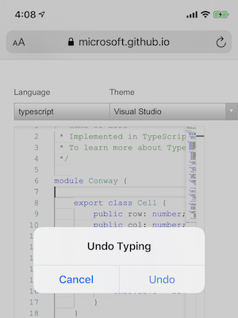

## Introduction

The UndoManager API allows web applications to modify the platform undo stack, and scope undo stacks to elements.

## Motivation

Many rich text editors on the web either implement custom editing operations which are not natively supported, or create fully customized editing experiences by intercepting user interaction in hidden editable elements and applying changes to the document using DOM APIs. There are many commonly used examples of this technique, including Google Docs, CodeMirror, and the Monaco editor. Furthermore, other web applications may allow the user to undo and redo changes in a context that is completely unrelated to editing (for instance, a drawing application that allows the user to undo or redo pen strokes). All the above scenarios share a common challenge: implementing a custom undo and redo experience, often by intercepting user events that are commonly associated with undoing or redoing in the current platform (such as control-Z or command-Z).

This imposes added complexity on the web application by requiring it to store a custom undo stack (which may additionally need to be kept in sync with the platform's undo stack). Worse yet, this makes it impossible to maintain compatibility with platform affordances for triggering undo and redo. Examples of this include the system menu bar on macOS<sup>[1]</sup>, and system-wide gestures on iOS<sup>[2, 3]</sup>.


*Figure 1: Undo and redo via the system menu bar on macOS.*


*Figure 2: System-wide editing controls on iOS, shown after a three-finger tap.*



*Figure 3: Modal undo UI on iOS, after shaking the device.*

To address these issues, we propose an API to allow web applications to add undoable and redoable actions — represented using `UndoItem` — to the native undo stack, which is represented using `UndoManager`.

## Interfaces

### UndoItem

An `UndoItem` represents a single undoable or redoable action. A custom `UndoItem` is created using:

* a `label`, which determines the text that is shown in system undo UI to describe the action being undone or redone.
* an optional `undo` callback, which is invoked when the platform undo manager pops a custom item off of the stack.
* an optional `redo` callback, which is invoked when the platform undo manager pushes a custom item (that has been popped) back onto the stack.
* an optional `merged` flag; if `true`, this means that the undo item will be undone or redone together with the previous item in the undo stack. By default, an `UndoItem` is not merged.

```
[
  Exposed=Window,
  Constructor(UndoItemInit initDict)
] interface UndoItem {
  readonly attribute DOMString label;
  readonly attribute boolean merged;
};

callback UndoItemCallback = void ();

dictionary UndoItemInit {
  required DOMString label;
  UndoItemCallback undo;
  UndoItemCallback redo;
  boolean merged = false;
};
```

### UndoManager

An `UndoManager` exposes the ability to query and manipulate the undo stack. `UndoManager` is backed by a list of `UndoItem`s where each `UndoItem`represents a reversible action, such as inserting or deleting text. Items may be pushed onto the undo manager by the user agent (for instance, when typing in a text field), and they may also be added by the page using `addItem`.

The `n`th `UndoItem` in the stack can be queried using `item(n)`, and the index of the current item is given by `position`. The `length` attribute exposes the total number of undo items in the stack. The `undo` and `redo` methods of `UndoManager` respectively decrement and increment the `position`, and, in the process, invoke and `undo` or `redo` methods of the previous item.

```
[
  Exposed=Window
] interface UndoManager {
  void undo();
  void redo();
  void addItem(UndoItem item);
  UndoItem item(unsigned long index);
  readonly attribute unsigned long length;
  readonly attribute unsigned long position;
};
```

### Extensions to Element

An element’s `undoManager` is the `UndoManager` associated with that element, or `null` if there is none (for instance, if the element is disconnected). An element also has a boolean `undoScope` attribute, which is initially `false`. If changed to `true`, that element and its descendants are associated with a new `UndoManager`, with its own undo stack.

```
partial interface Element {
  readonly attribute UndoManager undoManager;
  [CEReactions] attribute boolean undoScope;
};
```

## Examples

### Content Insertion

The following example implements a helper function, `insertContentAtSelection`, that takes an array of DOM nodes to insert at the current selection, as well as an optional undo label. This method replaces the selection with this content in a way that is reversible (undoable and redoable) using the platform's undo stack.

`replaceWithContent` and `rangeFromContent` are separate helper methods that respectively (1) replace a given range with a list of DOM nodes, and (2) compute a DOMRange given a list of sibling nodes. These are both utilized in the implementation of `insertContentAtSelection`.

```
function replaceWithContent(rangeToReplace, content) {
    // Returns the content being replaced.
    const replacedContent = rangeToReplace.cloneContents();
    rangeToReplace.deleteContents();
    for (let index = content.length - 1; index >= 0; index--)
        rangeToReplace.insertNode(content[index]);
    return Array.from(replacedContent.childNodes);
}

function rangeFromContent(content) {
    // Assumes that content is a list of DOM nodes in order.
    const range = document.createRange();
    range.setStartBefore(content[0]);
    range.setEndAfter(content[content.length - 1]);
    return range;
}
```

First, `insertContentAtSelection` uses `replaceWithContent` to remove the contents of the existing selection and replace it with `contentToInsert`; the existing content is kept in `originalContent`. The method then uses the browsing context's `UndoManager` to add a new `UndoItem`. The `undo` and `redo` callbacks are, respectively, implemented by swapping out the given content to insert for the original content that was replaced, and vice versa. After undoing or redoing, it additionally selects the inserted content (if any).

```
function insertContentAtSelection(contentToInsert, undoLabel) {
    const originalRange = getSelection().getRangeAt(0);
    const originalContent = replaceWithContent(originalRange, contentToInsert);
    document.undoManager.addItem(new UndoItem({
        label: undoLabel || "Editing",
        undo: () => {
            const rangeToUndo = rangeFromContent(contentToInsert);
            replaceWithContent(rangeToUndo, originalContent);
            getSelection().removeAllRanges();
            getSelection().addRange(rangeFromContent(originalContent) || originalRange);
        },
        redo: () => {
            const rangeToRedo = rangeFromContent(originalContent) || originalRange;
            replaceWithContent(rangeToRedo, contentToInsert);
            getSelection().removeAllRanges();
            getSelection().addRange(rangeFromContent(contentToInsert));
        }
    }));
}
```


