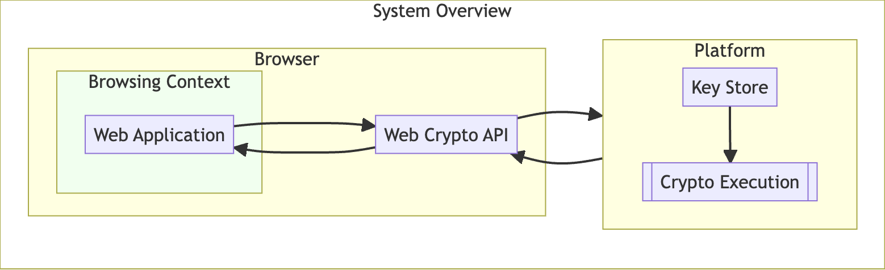

# Explainer: Remote CryptoKeys

Authors: [Jon Choukroun](https://github.com/jonchoukroun), Simon Gornall, Michael Hashe, Andy Pace, [Marcos Cáceres](http://github.com/marcoscaceres/). 

<!-- START doctoc generated TOC please keep comment here to allow auto update -->
<!-- DON'T EDIT THIS SECTION, INSTEAD RE-RUN doctoc TO UPDATE -->

- [Explainer: Remote CryptoKeys](#explainer-remote-cryptokeys)
  - [Problem](#problem)
  - [Goals](#goals)
  - [Non-Goals](#non-goals)
  - [Proposal](#proposal)
  - [`RemoteKeyParams` Dictionary](#remotekeyparams-dictionary)
  - [Extensions to the `SubtleCrypto` Interface](#extensions-to-the-subtlecrypto-interface)
  - [Examples](#examples)
  - [Security \& Privacy Considerations](#security--privacy-considerations)

<!-- END doctoc generated TOC please keep comment here to allow auto update -->

## Problem

Supporting end-to-end encryption on the web currently requires making significant compromises. Implementations may execute cryptographic operations in the client, potentially exposing a user’s private key to JavaScript, which makes keys vulnerable to exfiltration.

Alternative implementations may seek to protect the keys by executing cryptographic operations in other environments, such as the server, which forfeits the guarantees expected from end-to-end encryption.

Finally, implementations may preserve the security and ownership of private keys, which can complicate the user experience (e.g., by requiring the installation of browser extensions).

## Goals

- Support end-to-end encryption in web applications for various use cases: such as email, etc.
- Provide a means for web applications to execute cryptographic operations using “remote” key material that may reside outside of the browser.
- Prevent private keys from being extracted by, or otherwise exposed to, JavaScript.
- Reuse the existing Web Cryptography API with minimal updates and no breaking changes.
- Give users control of how/when their private keys are used.

## Non-Goals

- Standardize how keys are shared across devices and ecosystems.
- Solve for code transparency and other important protections against malicious web applications.
- Describe how key stores, web application providers, and other entities beyond the browser and platform should handle user consent and access control (see [Security Considerations](https://quip-apple.com/GGuFA2E20npX#temp:C:SBaa6fb238aaa924aab86542a7f7) and [Privacy Considerations](https://quip-apple.com/GGuFA2E20npX#temp:C:SBa0cee157d18f946a38799baec9) sections).

## Proposal

We identified 4 requirements that informed the design of this proposal:

1. Private key material is never directly exposed to JavaScript, but can be used to perform cryptographic operations with the user’s consent.
2. Private key ownership is exclusive to the user - keys are not escrowed, cryptographic operations are not executed by a 3rd party.
3. Malicious web sites cannot use this feature to track users (e.g., via a digital fingerprint or the creation of a super cookie).
4. No additional user experience burden.

The rest of this document illustrates how end-to-end encryption on the web can be supported using minimal extensions to the [Web Cryptography API](https://www.w3.org/TR/WebCryptoAPI/) to support executing cryptographic operations (encrypt, decrypt, sign, and verify) using keys from a user’s secure key store.



We propose a mechanism through which a web application can request that a cryptographic operation be executed on a given data chunk, using the following process:

1. The web application first acquires an instance of a “remote” `CryptoKey` by calling `getRemoteKey()`, [detailed below](https://quip-apple.com/GGuFA2E20npX#temp:C:SBa6c0fc02f8d014b3bbeaccc68e).

    Note: This is analogous to calling `generateKey()` to instantiate a local `CryptoKey`.

2. The web application passes this `CryptoKey` as an argument to methods in the .`subtle` namespace, along with the data to sign, decrypt, etc.
3. The browser then passes the `CryptoKey` and data to the platform. This may be the default key store, an entity managing one or more key stores, or some other process running on the operating system.
    1. The device may have more than one such process, it is up to the browser to select one - with user preference guiding the choice.
4. This platform process makes the appropriate access control and user consent checks, and searches for a matching key.
5. If the key is found, the process will execute the requested cryptographic operation on the given data, and return the output to the browser.
6. If the key is not found, or access control checks fail, the process will return an error to the browser.
    1. Returning the same error for both of these cases mitigates a privacy vulnerability where a web application could check on the existence of a key.

## `RemoteKeyParams` Dictionary

We propose defining a kind of “remote” key that is usable with `CryptoKey` ‘s [[algorithm]] internal slot. That is, the key material exists outside the browser on the platform or elsewhere. This may be a secure key store, password manager, USB or BlueTooth device, etc.

When creating a remote instance of a `CryptoKey`, the browser sets its attributes accordingly:

- The `extractable` attribute is always `false`.
- For the `[[algorithm]]` internal slot, we define a`RemoteKeyParams` dictionary with the following members:

```WebIDL
// The [[algorithm]] internal slot takes a RemoteKeyParams
dictionary RemoteKeyParams : Algorithm {
  DOMString userIdentifier;
  DOMString? keyId;
  DOMHighResTimeStamp? expiresAt;
}
```

- `name` member (of Algorithm): `"remote"` - indicates the key material is “remote”.
- `userIdentifier:` used by the key store when searching for the key (e.g., an email address).
- `keyId?` : may be returned from `getRemoteKey()` to be used for subsequent key lookups.
- `expiresAt:` - a timestamp indicating when the returned key handle will no longer be honored.

## Extensions to the `SubtleCrypto` Interface

The intention of this proposal is to leverage the existing SubtleCrypto namespace. A remote instance of the `CryptoKey` can be passed as the key argument to existing cryptographic methods without requiring an API change.

To support getting a `CryptoKey` handle to remote key material, we propose a new method, an alternative to the existing `generateKey()` function. This method takes a `RemoteKeyParams` dictionary (see above) and an array of key usages. Because remote keys are never extractable, we omit the `extractable` boolean parameter from the method signature:

```WebIDL
Promise<CryptoKey> getRemoteKey(
  RemoteKeyParams params, sequence<KeyUsage> keyUsages
);

```

We propose the following implementation of `getRemoteKey()`:

1. When called, `getRemoteKey()` receives `RemoteKeyParams` and `keyUsages` parameters, otherwise returns a rejected Promise with some error.
1. Return a Promise, and run the following steps [in parallel](https://html.spec.whatwg.org/#in-parallel).
1. The browser wraps the existing parameters with the origin of the requesting web application.
1. The browser communicates with the platform, passing the parameters to match an existing key.
  1. The browser will need to implement some UI for choosing one out of possibly several key providers. User preferences should guide this choice.
1. How the platform handles access control and user consent checks is out of scope for this proposal. However any response that isn’t a success should reject the Promise with a `NotFoundError`.
1. On success, the platform should return a unique identifier which can be used for subsequent key lookups.
1. The browser then creates a `CryptoKey` instance, setting the identifier returned from the platform as the `keyId` member, and the expiration time as the `expiresAt` member - if provided.
  1. A platform process may choose not to return these values, forcing subsequent cryptographic calls through the SubtleCrypto API to do a full key search.
1. Finally, resolve the Promise with this `CryptoKey` object.

## Examples

Getting a CryptoKey handle, to be later used to sign an email message body.

```JS
const keyHandle = await window.crypto.subtle.getRemoteKey(
    {
        name: "remote",
        userIdentifier: "alice@example.com"
    },
    ["sign"]
);

console.log(keyHandle.algorithm.keyId) // a platform-unique identifier
console.log(keyHandle.algorithm.expiresAt) // a timestamp 3 hours from now
console.log(keyHandle.extractable) // always "false"
console.log(keyHandle.usages) // "sign"
```

Using the previously retrieved key handle to sign an email message.

```JS
// Dummy function that assembles message contents into a bytes array
// @type ArrayBuffer
const message = assembleMessage();

// @type ArrayBuffer
const signature = await window.crypto.subtle.sign(
    { name: "RSASSA-PKCS1-v1_5" },
    keyHandle,
    message
);

```

## Security & Privacy Considerations

This proposal focuses on obtaining access to key handles, but does not dictate the access control and user consent checks that the platform should enforce. Instead we will list concerns and possible mitigations (where possible) that a platform SHOULD implement to better protect these keys.

- If the web application is compromised, automatically providing use access to the user’s keys will allow an attacker to decrypt sensitive data and/or digitally sign as the user. While preventing web application compromise is entirely out of scope, we recommend certain mitigations:
  - As the browser will provide the web application’s origin, platforms should scope the user’s keys to a domain and ensure they match before providing access. Domain-scoped keys also mitigate using a single key across multiple domains for tracking purposes.
  - Prompting the user for consent on key access is another means to ensure cryptographic operations are not being executed without their knowledge. This approach must strike a balance between protection and a burdensome UX.
- For many use cases, leaking a user’s public keys can be a significant issue. For example, a spammer with a user’s public encryption key can send encrypted messages that will undoubtedly sail through spam filters. We recommend using this mechanism to get a handle to public keys, to mitigate this risk.
