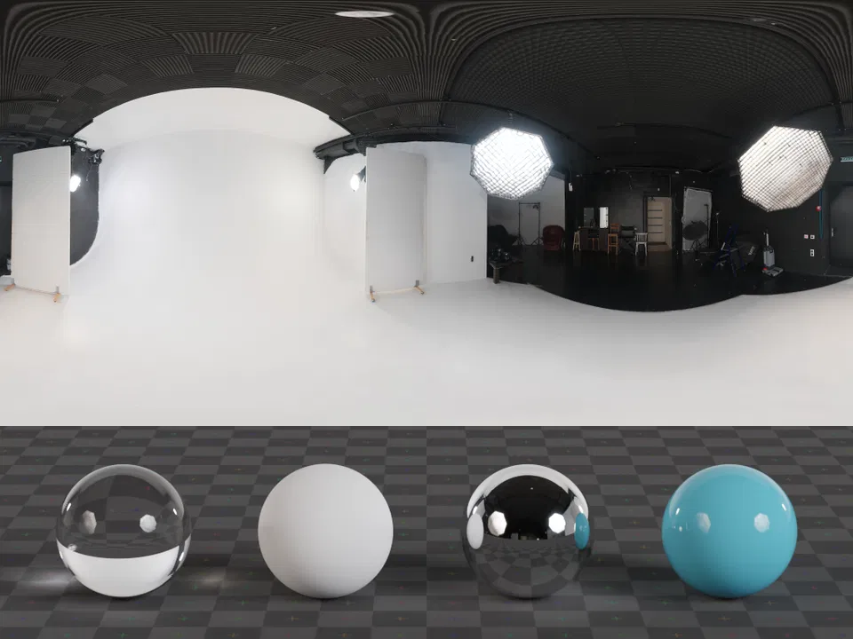

# Spatial Backdrop Explainer

The purpose of this document is to explain a new [link type](https://html.spec.whatwg.org/#linkTypes) for adding Immersive Backdrops from 3D models to web pages. The primary target for this is for standalone head mounted immersive displays, but it could have application on other platforms too.

## Authors

* [Ada Rose Cannon](https://github.com/adarosecannon)
* [Jean Haberer](https://github.com/jeanhbr)

## Background

Operating systems on virtual reality devices have the capability of displaying virtual environments behind the windows and volumes of the various applications running on the device including its web browsers.
This new link type enables Websites to change this virtual environment to one that is specified by the web page.


*Model Source: [Kraków's bed by on sketchfab by Wirtualne Muzea Małopolski](https://sketchfab.com/WirtualneMuzeaMalopolski/collections/national-museum-in-krakow-5bf7a88a295848fa886898a9335d4aa7)*

## Use Cases

* Website ambiance, e.g., look at the page for a popular streaming series in an environment from that series. 
* Displaying life-sized Products such as a Car Showroom, Hotel Room
* Informative, see these dinosaurs to scale as you read about the jurassic era.

Developers should not assume the user or UA will always display the backdrop they specified. Like theme color it has an effect outside of the web page but isn’t guaranteed to be present. This feature works best for bonus content as the page will not know if it is supported or currently active.

## Concepts

This capability is for displaying full scale 3D models as virtual environments. Since 3D model formats are quite flexible this could have a wide variety of appearance such as hand crafted polygon scenes, scans of real world environments or simple geometry with photographic textures applied.
This is related to the HTML model element as it is also used for displaying 3D models in the context of a Web Page, although this places the 3D content around the user rather than embedding it into a web page.
This doesn’t cover using 2D Images or Videos as backdrop sources although they may be included as part of a 3D model.
2D images can be used for providing environmental lighting for the 3D model.

## Usage

The backdrop should be specified using a link in the head which indicates that the browser should download the model asset which can be supported by the operating system, it may also include an environment map which describes the lighting for lit materials. 

```html
<link
    media="(prefers-color-scheme: light)"
    rel="spatial-backdrop"
    type="model/**`vnd.usdz+zip`**"
    href="garden.usdz"
    alt="A science fiction cantina with 3 aliens playing instruments"
    environmentmap="sunset.hdr">
```

Just like with stylesheets you can use media to pick different models and environment maps for light mode/dark mode or prefers-reduced-data.

The backdrop must be requested in the top level frame, backdrops in frames are ignored.

## Alternative Considered Usage

Using a CSS @rule approach is being considered as an alternative.

```
*@backdrop* {
    model: url("./bg.usdz");
    environment: url("./bg-env.hdr");
    content: "A science fiction cantina with 3 aliens playing instruments";
}
```

## Requesting the Assets

The processing model for the 3D model asset should be the same as for the assets used by the `<model>` tag. 

The resource described in the `environmentmap` attribute should be requested with an accepts header listing the types which are supported which should at least include the HDR “`image/vnd.radiance`” type. This header is to ensure environment maps can use future formats when improved image formats become available.

## Displaying the backdrop

The backdrop should not be displayed automatically.
A user agent affordance to activate the backdrop should be used to trigger the backdrop to be displayed.

The model should be placed so that the origin of the 3D scene is at the user’s feet.
For the scene coordinates the following assumptions are made to match with WebXR:

* Y is up
* 1 unit is 1 meter unless units are specified in the file

The scene should be rotated about the Y-axis so that the Z axis of the backdrop is aligned with the normal of the page projected onto the XZ plane, i.e. the line extending from the page towards the user but parallel with the ground.

The model will always be rendered as a bottom layer so that it will never overlap any operating system windows, so if a user tries to load a model which would overlap OS windows this may look odd and the browser may choose to clip parts of the model for user comfort. It’s good practice for developers to leave a several meter region of clear space around the origin for  the user to work in.

The provided environment map should be used for the model but can also be used for the browser chrome and other OS elements as would befit replacing the OS backdrop environment.

If no environment map is provided then a UA provided fallback environment map should be used.

If an environment map is provided but fails to load then do not show the backdrop.

If the model asset is malformed fail silently to the Website but inform the end user that the model could not be loaded.

If the model uses more memory than the device can allocate then it is expected to fail silently to the Website but inform the end user that the model could not be loaded.

In an event in which the model cannot be displayed then don’t use the environment map.

If the Website changes the backdrop model or environment map whilst it is being displayed then update the backdrop with the new model or environment map.

## Backdrop Persistence

The backdrop should be removed when the page is hidden. 

If another tab replaces the backdrop then the tab which provided the old backdrop can no longer change what the backdrop is, control is given to the tab which provided the new backdrop.

## Backdrop lighting

There are two main types of lighting typically encountered in 3D models for real time use:

Punctual lights as described as part of a backdrop’s model may not be supported.

The other kind of lighting is an externally-imposed environment map. This image is what is used for reflections and provides the ambient light for a scene. This environment lighting map is typically an image format with a large bit depth because the brightest parts of the environment (such as lights or the sun) need to displayed at an appropriate brightness when viewed in a reflection on a dull surface.


*A typical HDR backdrop (top) with its effect on various materials shown below on 4 balls with different surfaces (bottom). CC0 [Source: PolyHaven](https://polyhaven.com/a/studio_small_09)*

These light sources are used to light the 3D model, but may also be used to light the browser chrome and other physically-lit parts of the operating system to give a natural appearance.

If a backdrop is not provided use the same default environment map from the &lt;model&gt; element.

## Accessibility

The content provided by this like theme color or background images are only presentational and thus, can be ignored for the purposes of visual accessibility but the description should be revealed through the UA elements used to enable the environment backdrop.

## Handling models which are computationally expensive to render

Computationally expensive models can cause heating issues and reduce battery life. 

It is very easy to accidentally build 3D models to require significant resources to render but at the same time it is hard to come up with heuristics that can for sure say that a particular model will be expensive without attempting to render it. For example, a scene with only a few polygons can be expensive to render if expensive materials are used which take up a large area of the user’s view.

Since there is very limited capability of detecting the load of a backdrop on a system before rendering it there needs to be the capability to safely degrade if it cannot be handled. Should a backdrop use too much CPU, GPU, Memory or other resources then it can be automatically turned off without informing the page it originated from.
